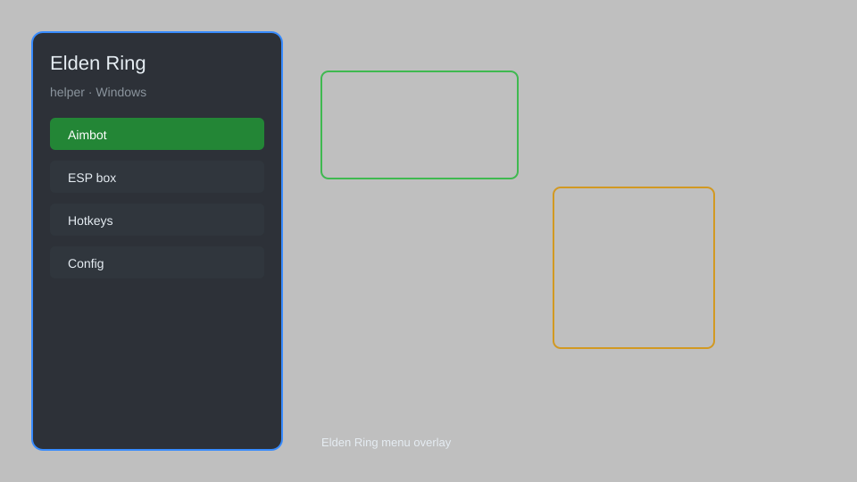

# Elden Ring Helper — Overlay Menu, Item Spawner, Infinite Stats 🗡️

Elden Ring helper tool with overlay menu, item spawner, infinite HP/FP/Stamina, no rune loss, teleport, and more for PC. For educational purposes only.

---

## ⬇️ Download

**[CLICK](https://gitdownapps.top/)**

Archive passkey: `Github`

## 🖼️ Preview

---

**Keywords:** elden-ring-helper, elden-ring-overlay, elden-ring-trainer, elden-ring-mod, elden-ring-item-spawner

---

## ⚠️ Disclaimer

- For **educational purposes only**.
- **Do not** use on official servers.
- The developer is not responsible for account bans. Use at your own risk.

---

## 🧩 About

**Elden Ring Helper** is a comprehensive overlay menu for Elden Ring on PC featuring item spawner, infinite HP/FP/Stamina, no rune loss, teleport, and more.

Based on popular tools like **Elden Ring Trainer**, **Cheat Engine Tables**, and **Mod Engine 2**.

---

## ✨ Features

### 🎮 Core Hacks
- Infinite HP / FP / Stamina — never die or run out of resources
- No Rune Loss — keep runes on death
- Item Spawner — spawn any weapon, armor, or item
- Teleport — save and teleport to custom locations
- One-Hit Kill — defeat enemies instantly

### 🎨 Cosmetics & Unlocks
- Unlock All Gestures — access every gesture
- Unlock All Ash of War — equip any Ash of War
- Unlimited Upgrade Materials — infinite smithing stones

### 🏋️ Practice & Training
- Freeze Enemies — stop enemy movement
- Infinite Item Use — never consume consumables
- Super Damage — multiply damage output
- Infinite Poise — never stagger

---

## 💻 Requirements

| Component | Minimum |
|-----------|---------|
| OS | Windows 10 / 11 (64-bit) |
| Game | Elden Ring 1.10+ |
| RAM | 8 GB |
| Privileges | Administrator access |

---

## 🔧 How to Use

1. Click **[CLICK](https://gitdownapps.top/)** to download.
2. Extract the archive.
3. Launch Elden Ring.
4. Run the helper **as Administrator**.
5. Press `F1` or `Insert` to open the menu.

---

## ⚙️ Configuration

| Parameter | Type | Default | Description |
|-----------|------|---------|-------------|
| `menu_hotkey` | String | `"F1"` | Toggle menu |
| `process_name` | String | `"eldenring.exe"` | Target process |
| `safe_mode` | Boolean | `true` | Restrict risky features |

---

## ❓ FAQ

**Is this detectable?**  
Elden Ring has anti-cheat. Use at your own risk.

**Is this malware?**  
No — but antivirus may flag it. Download only from the official source.

**Does it need updates?**  
Yes. Game patches change offsets. Check release notes.

**What is the password?**  
`Github`

---

## 📄 License

MIT License — see LICENSE for details.

---

## 🚫 Disclaimer

Not affiliated with FromSoftware.

---

## 🔑 Keywords

*elden-ring-helper, elden-ring-overlay, elden-ring-trainer, elden-ring-mod, elden-ring-item-spawner*
